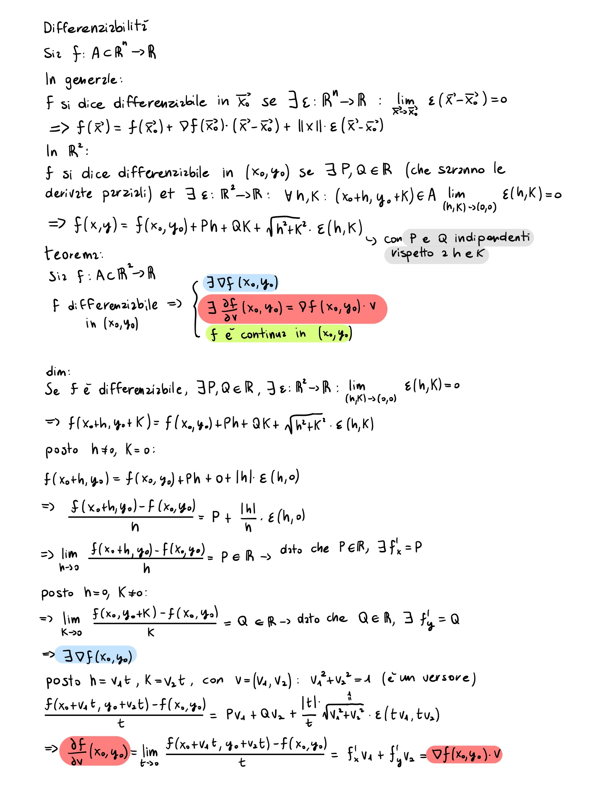

# Appunti di Analisi II

Benvenuto nella repository degli appunti di **Analisi II**. Qui puoi trovare una raccolta di note e risorse che ho preparato durante il mio studio.

### Accesso Completo agli Appunti

Puoi visualizzare e scaricare l’intera raccolta di appunti direttamente dalle seguenti cartelle su **Google Drive**:
- [`Esercizi`](https://drive.google.com/drive/folders/1QMWka85t4Fu8V0G0SH0EjPjMPx-zQME8?usp=sharing)
- [`Teoria`](https://drive.google.com/drive/folders/1xbElb1XOOmicT8JK0i9q6ZYc6ZZ-Tbxm?usp=sharing)

**Nota bene**: Non sono riuscito a sistemare tutti gli appunti di Teoria in bella copia, dunque ho riportato pure gli appunti presi a lezione.

### Contatti

Se hai domande o feedback, sentiti libero di contattarmi su Instagram: [@giacomo_radicchi](https://www.instagram.com/giacomo_radicchi).
